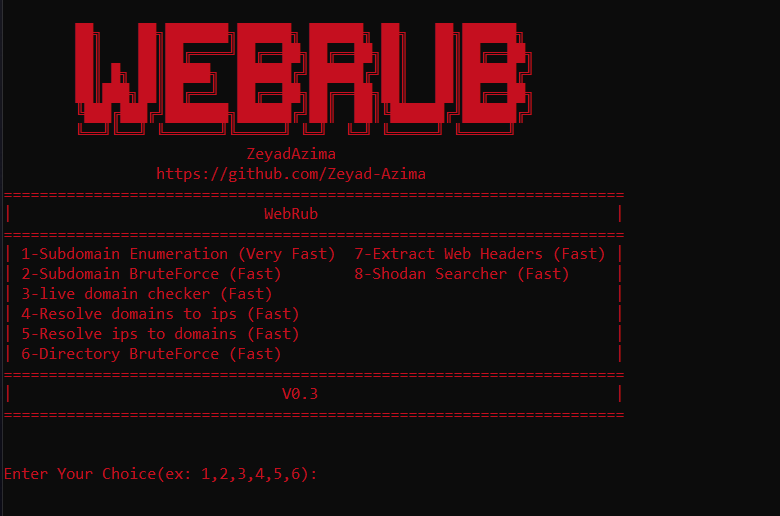

# WebRub
Web Reconnaissance Framework Written in Ruby
```
                                          ██╗    ██╗███████╗██████╗ ██████╗ ██╗   ██╗██████╗
                                          ██║    ██║██╔════╝██╔══██╗██╔══██╗██║   ██║██╔══██╗
                                          ██║ █╗ ██║█████╗  ██████╔╝██████╔╝██║   ██║██████╔╝
                                          ██║███╗██║██╔══╝  ██╔══██╗██╔══██╗██║   ██║██╔══██╗
                                          ╚███╔███╔╝███████╗██████╔╝██║  ██║╚██████╔╝██████╔╝
                                          ╚══╝╚══╝ ╚══════╝╚═════╝ ╚═╝  ╚═╝ ╚═════╝ ╚═════╝
```


# Requirements:
```
Rust
Ruby 2.7
python 3.x
Whatweb
```

# Install:
```
git clone https://github.com/Zeyad-Azima/WebRub.git
cd WebRub
sudo chmod +x install.sh
./install.sh
```

# Features:
1- Features in V0.3
```
Problems Fixed: Live domain Checker

1-Subdomain Enumeration
  - Subdomain Enumeration Using Findomain [https://github.com/Findomain/Findomain]

2-Subdomain BruteForcing
  - Bruteforce Subdomains using wordlist

3-live domain checker
  - Check live domains for web service

4-Resolve domains to ips
  - Resolving domains to ips

5-Resolve ips to domains
  - Resolving ips to domains

6-Directory BruteForce
  - Bruteforce Web Directories and Files using wordlist

7-Extract Web Headers
  - Extract web headers and web technologies using Whatweb

8-Shodan Searcher
  - Search for target on shodan
  - Extract Headers, Hosts, Open Ports & Vulnerabilities (CVE)

```
2- Features Coming with the next updates
```
Urls Extractor (soon)

Parameter Bruteforce (soon)

Server Exploiter (soon)

Port Scanning (soon)

Google Dorking (soon)

Leak Searcher (soon)

WAF Detector (soon)

and more ...
```

# Screenshot:



# Author:
<a href='https://www.facebook.com/elkingzeyad.azeem'>@ZeyadAzima</a>
