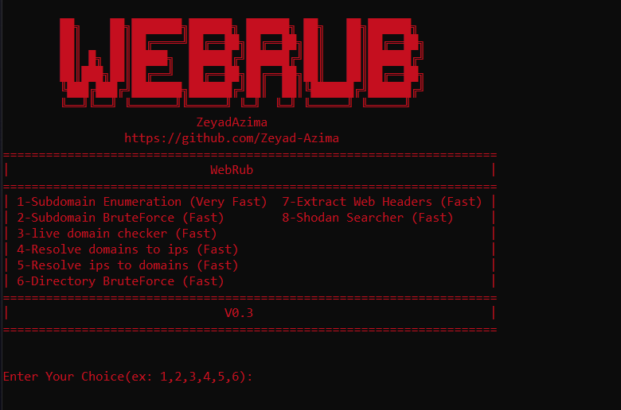
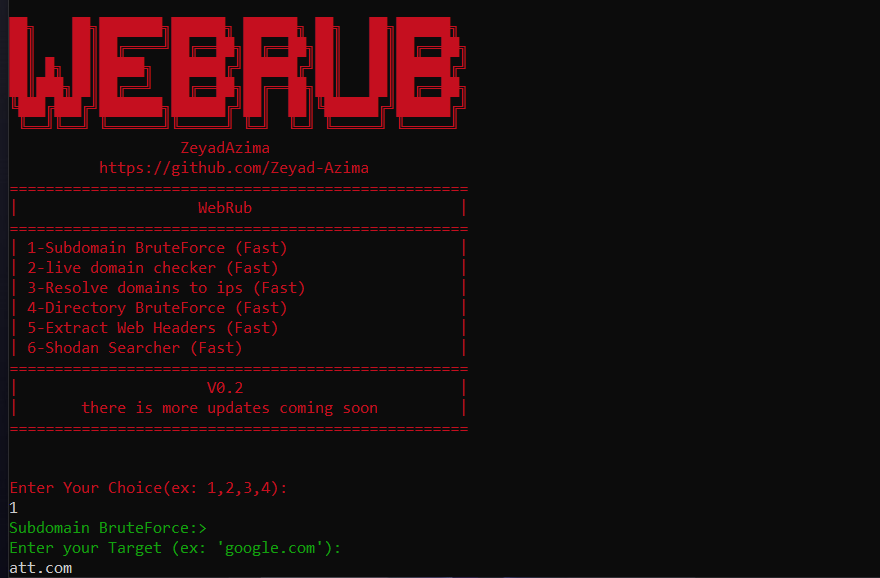
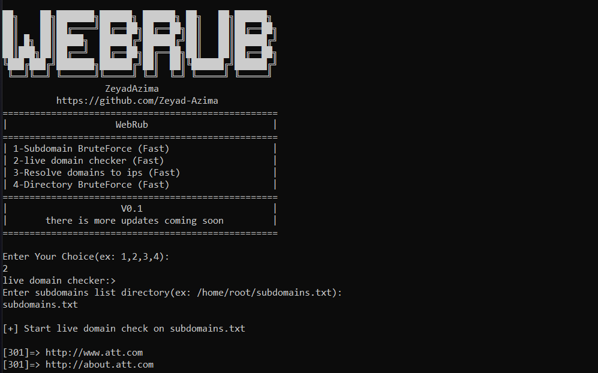
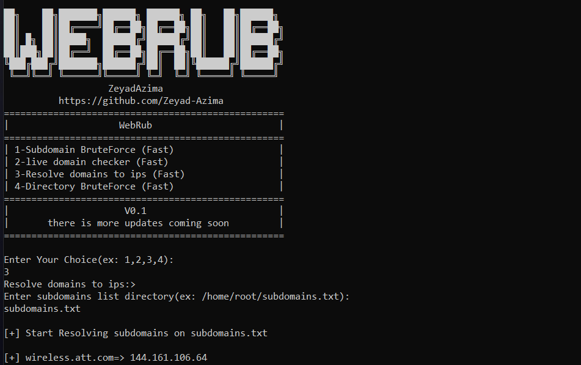
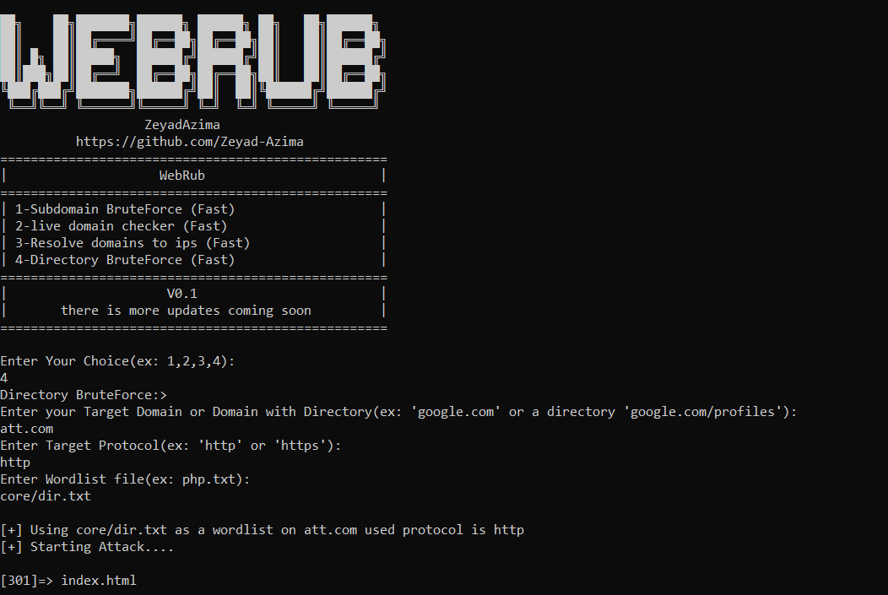
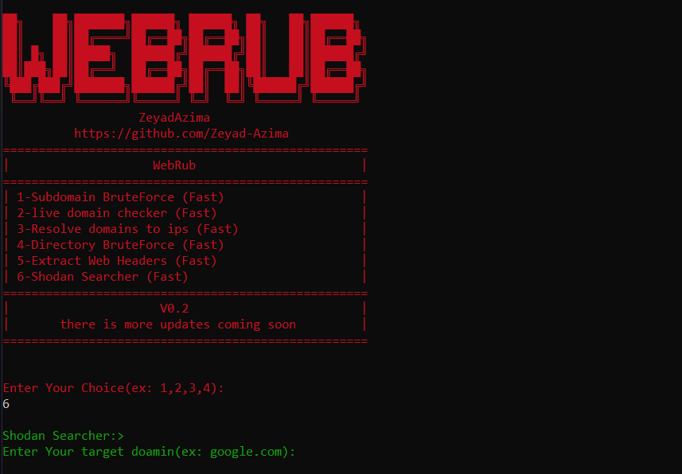

# WebRub
Web Reconnaissance Framework Written in Ruby

# Install:
```
sudo apt install ruby-full
sudo apt install python3
sudo apt install python3-pip
gem install colorize
git clone https://github.com/Zeyad-Azima/WebRub.git
cd WebRub
pip3 install -r requirements.txt
chmod +x WebRub.rb
sudo ruby WebRub.rb
```
# Requirements:
```
Ruby 2.7
python 3.x
```

# Features:
1- Features in V0.2
```
1-Subdomain BruteForcing
  - Bruteforce Subdomains using wordlist
  
2-live domain checker
  - Check live domains for web service
  
3-Resolve domains to ips
  - Resolving domains to ips
  
4-Directory BruteForce
  - Bruteforce Web Directories and Files using wordlist
  
5-Extract Web Headers
  -Extract web headers and web technologies using Whatweb

6-Shodan Searcher
  -Search for target on shodan 
  -Extract Headers, Hosts, Open Ports & Vulnerabilities (CVE)

```
2- Features Coming with the next updates
```
Urls Extractor (soon)

Port Scanning (soon)

Google Dorking (soon)

Leak Searcher (soon)

WAF Detector (soon)
and more ...
```

# Screenshots:












# Author:
<a href='https://www.facebook.com/elkingzeyad.azeem'>@ZeyadAzima</a>
